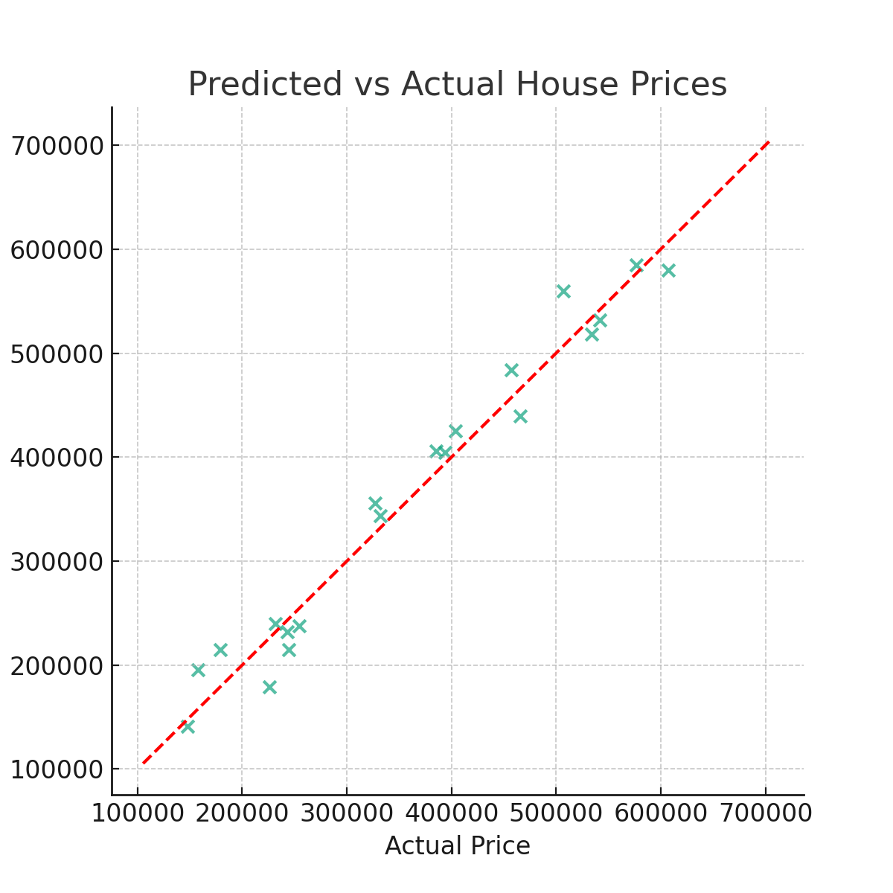

# 🏠 House Price Predictor

[](https://www.python.org/)
[](LICENSE)

A simple and interpretable machine learning project using **Linear Regression** to predict house prices based on square footage, number of bedrooms/bathrooms, location, and age of the property.

---

## 📊 Example Output



---

## 📁 Files Included

| File                     | Description                                  |
|--------------------------|----------------------------------------------|
| `house_data.csv`         | Sample dataset with 100 synthetic rows       |
| `house_price_predictor.py` | Main script for training + evaluation       |
| `model.pkl`              | Saved regression model using `pickle`        |
| `price_plot.png`         | Visual of predicted vs actual prices         |
| `requirements.txt`       | Required Python libraries                    |

---

## ⚙️ How to Use

### 📦 Install Dependencies

```bash
pip install -r requirements.txt
```

### ▶️ Run the Script

```bash
python house_price_predictor.py
```

### ✅ Output

- Model evaluation printed in the terminal (MAE, R²)
- Scatter plot saved as `price_plot.png`
- Model saved as `model.pkl`

---

## 🧠 Model Details

- Algorithm: `LinearRegression()`
- Target: `Price (USD)`
- Features:
  - Square Footage
  - Bedrooms
  - Bathrooms
  - Age of Home
  - Location (One-Hot Encoded)

---

## 🚀 Future Enhancements

- Add support for user-uploaded CSVs
- Create a Flask API version
- Feature normalization and outlier handling

---

## 📝 License

This project is open-source under the [MIT License](LICENSE).

---

> Built for learning and portfolio showcase purposes.
